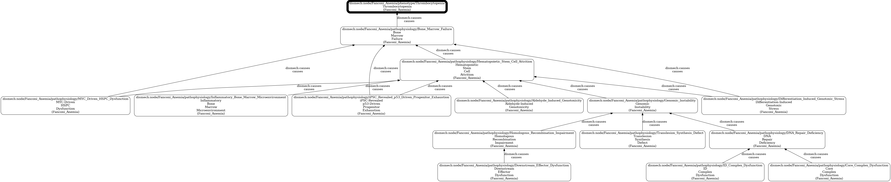
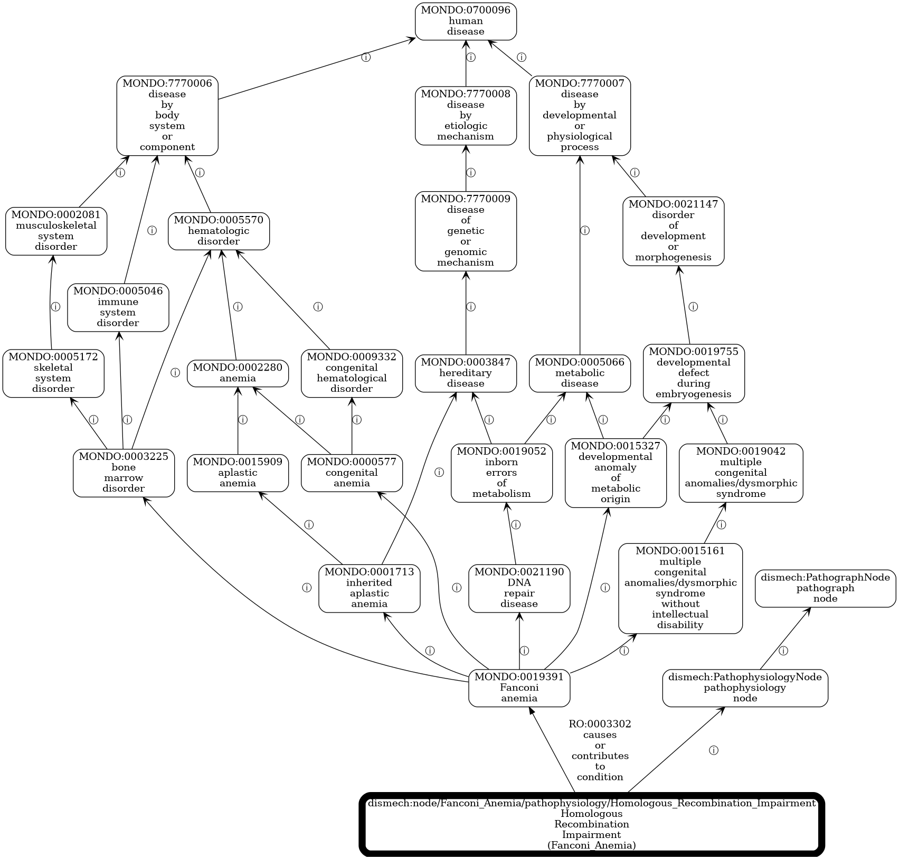

# Exploring the TBox with OAK

[OAK](https://github.com/INCATools/ontology-access-kit) reads the build through
its `funowl:` adapter, which parses with py-horned-owl. Use the OFN output,
because it carries the prefix declarations OAK needs to show CURIEs.

Every example below is real output from the bone-marrow-failure sample, which
`just example` builds. Long listings are cut short with `...`, and the
`relationships` tables show only the columns that matter here.

```bash
just example    # five entries + GO and MONDO modules, reasoned -> build/bmf-reasoned.ofn
R=funowl:build/bmf-reasoned.ofn
```

On this sample each command takes 3–5 seconds. On the full build
(`build/dismech-pathograph.ofn`, about 200 MB) it takes about 20 seconds,
almost all of it parsing.

**Use exact CURIEs, not label search.** `runoak … info 'l~…'` works but scans
every label through the generic search path; on a 4 MB file it took two
minutes. To find a node, grep the OFN file for its IRI:
`grep -o 'dismech/node/Fanconi_Anemia/pathophysiology/[A-Za-z0-9_]*' build/bmf.ofn`.

## Node CURIEs

Every pathograph node is a class with the IRI
`https://w3id.org/monarch-initiative/dismech/node/<entry>/<kind>/<slug>`,
which OAK shows as `dismech:node/<entry>/<kind>/<slug>`:

```
dismech:node/Fanconi_Anemia/pathophysiology/Genomic_Instability
dismech:node/Fanconi_Anemia/phenotype/Thrombocytopenia
dismech:node/Fanconi_Anemia/treatment/Androgen_Therapy
```

## Is-a: where a node sits in the node-class tree

```console
$ runoak -i $R tree -p i dismech:node/Fanconi_Anemia/pathophysiology/Genomic_Instability
* [] dismech:PathographNode ! pathograph node
    * [i] dismech:PathophysiologyNode ! pathophysiology node
        * [i] dnc:GENOMIC_EFFECT ! GENOMIC EFFECT
            * [i] dnc:GENOMIC_EFFECT__GENOME_INSTABILITY ! genome instability
                * [i] **dismech:node/Fanconi_Anemia/pathophysiology/Genomic_Instability ! Genomic Instability (Fanconi_Anemia)**
```

`dnc:` is the node-class tree. This node's place in it is asserted, because
the tree cites it as a worked example. For most nodes, the place is inferred by
the reasoner from the tree's logical definitions; see
[Classification](#classification-by-the-tree-definitions).

## Non-is-a edges

### Everything on one node

```console
$ runoak -i $R relationships dismech:node/Dyskeratosis_Congenita/pathophysiology/Impaired_Telomere_Maintenance
predicate                  object                                   object_label
rdfs:subClassOf            dnc:GENOMIC_EFFECT__GENOME_INSTABILITY   genome instability
RO:0003302                 MONDO:0015780                            dyskeratosis congenita
dismech:cellular_components GO:0005697                              telomerase holoenzyme complex
dismech:molecular_functions GO:0070034                              telomerase RNA binding
dismech:cell_types         CL:0000037                               hematopoietic stem cell
dismech:genes              hgnc:11824                               TINF2
dismech:genes              hgnc:25522                               WRAP53
...
```

Three kinds of edge show up here:

| Edge | Meaning |
|---|---|
| `dismech:<slot>` (`genes`, `cell_types`, `biological_processes` …) | a descriptor bound on the node, read as "this node involves some instance of that term". With a `modifier`, the filler is `(term and modifier value INCREASED)`. |
| `RO:0003302` *causes or contributes to condition* | the node's link to its entry's disease. See [Back to the disease](#back-to-the-disease-and-to-mondo). |
| graph edges (`dismech:causes`, `dismech:treats` …) | the pathograph's own edges, below |

### Graph edges by predicate (full KB)

| Predicate | Axioms | From → to |
|---|---:|---|
| `causes` | 46,429 | pathophysiology → pathophysiology / phenotype |
| `targets` | 5,961 | treatment → mechanism |
| `contributes_to` | 5,521 | gene → mechanism |
| `treats` | 3,396 | treatment → phenotype |
| `models` / `partially_models` / `fails_to_model` | 2,070 / 1,268 / 292 | model → mechanism |
| `variant_of` | 1,610 | variant → gene |
| `readout` | 1,543 | mechanism → biomarker or phenotype |
| `leads_to` | 806 | phenotype → phenotype (sequelae) |
| `triggers` / `exacerbates` / `predisposes_to` / `modulates` / `protects_against` | 535 / 174 / 284 / 21 / 20 | exposure → mechanism |
| `measures` / `perturbs` / `rescues` | 410 / 313 / 219 | model → mechanism |
| `has_regulatory_target` | 23 | variant → gene |

Plus 64,144 disease links, 49,335 descriptor existentials, 3,461 `conforms_to`
subsumptions and 63,803 links from phenotype, exposure, treatment, gene and
biomarker nodes to their bound term. `just tbox` prints these counts.

`dismech:causes` and `dismech:leads_to` are declared sub-properties of
`RO:0002411` *causally upstream of*, so a query in RO terms reaches them.

### Following a causal chain

Each edge points from cause to effect, so OAK's "ancestors" over
`dismech:causes` are a node's downstream effects:

```console
$ runoak -i $R tree -p dismech:causes dismech:node/Fanconi_Anemia/pathophysiology/Genomic_Instability
* [] dismech:node/Fanconi_Anemia/phenotype/Myelodysplastic_Syndrome ! Myelodysplastic Syndrome (Fanconi_Anemia)
    * [causes] dismech:node/Fanconi_Anemia/pathophysiology/Clonal_Evolution ! Clonal Evolution (Fanconi_Anemia)
        * [causes] **dismech:node/Fanconi_Anemia/pathophysiology/Genomic_Instability ! Genomic Instability (Fanconi_Anemia)**
* [] dismech:node/Fanconi_Anemia/phenotype/Thrombocytopenia ! Thrombocytopenia (Fanconi_Anemia)
    * [causes] dismech:node/Fanconi_Anemia/pathophysiology/Bone_Marrow_Failure ! Bone Marrow Failure (Fanconi_Anemia)
        * [causes] dismech:node/Fanconi_Anemia/pathophysiology/Hematopoietic_Stem_Cell_Attrition ! Hematopoietic Stem Cell Attrition (Fanconi_Anemia)
            * [causes] **dismech:node/Fanconi_Anemia/pathophysiology/Genomic_Instability ! Genomic Instability (Fanconi_Anemia)**
...
```

Its "descendants" are everything upstream of a phenotype:

```console
$ runoak -i $R descendants -p dismech:causes dismech:node/Fanconi_Anemia/phenotype/Thrombocytopenia
dismech:node/Fanconi_Anemia/pathophysiology/Bone_Marrow_Failure ! Bone Marrow Failure (Fanconi_Anemia)
dismech:node/Fanconi_Anemia/pathophysiology/Hematopoietic_Stem_Cell_Attrition ! Hematopoietic Stem Cell Attrition (Fanconi_Anemia)
dismech:node/Fanconi_Anemia/pathophysiology/Genomic_Instability ! Genomic Instability (Fanconi_Anemia)
dismech:node/Fanconi_Anemia/pathophysiology/DNA_Repair_Deficiency ! DNA Repair Deficiency (Fanconi_Anemia)
dismech:node/Fanconi_Anemia/pathophysiology/Core_Complex_Dysfunction ! Core Complex Dysfunction (Fanconi_Anemia)
...
```

`viz --down` draws the same upstream view (needs `og2dot` from the npm package
`obographviz`, plus Graphviz):

```bash
runoak -i $R viz --down -p dismech:causes --no-view \
  -o docs/images/fanconi-thrombocytopenia-causes.png \
  dismech:node/Fanconi_Anemia/phenotype/Thrombocytopenia
```



### Treatments

```console
$ runoak -i $R relationships --direction down -p dismech:targets dismech:node/Fanconi_Anemia/pathophysiology/Bone_Marrow_Failure
subject                                                                   predicate
dismech:node/Fanconi_Anemia/treatment/Androgen_Therapy                    dismech:targets
dismech:node/Fanconi_Anemia/treatment/Hematopoietic_Stem_Cell_Transplantation_HSCT  dismech:targets
```

## Back to the disease, and to MONDO

Each pathophysiology and phenotype node is linked to its entry's disease term
by an existential on the node:

```
<pathophysiology node> SubClassOf RO:0003302 'causes or contributes to condition' some <MONDO disease>
<phenotype node>       SubClassOf RO:0002201 'phenotype of'                       some <MONDO disease>
```

The axiom is on the node, not on the MONDO class, on purpose. A node is a
disease-specific class, so "every instance of FA genomic instability
contributes to some case of FA" is true. The reverse direction, `MONDO:0019391
SubClassOf 'has phenotype' some <node>`, would say every case of Fanconi
anemia has every curated phenotype, which dismech does not claim (its
phenotypes carry frequencies). Module nodes have no disease term, so they get
no link. Both RO relations were looked up in RO
(`runoak -i sqlite:obo:ro labels RO:0003302 RO:0002201`), not written from
memory.

### From a disease to its mechanisms

```console
$ runoak -i $R relationships --direction down -p RO:0003302 MONDO:0019391
subject                                                                          object_label
dismech:node/Fanconi_Anemia/pathophysiology/Translesion_Synthesis_Defect          Fanconi anemia
dismech:node/Fanconi_Anemia/pathophysiology/Homologous_Recombination_Impairment   Fanconi anemia
dismech:node/Fanconi_Anemia/pathophysiology/Differentiation_Induced_Genotoxic_Stress  Fanconi anemia
...                                                                              (22 nodes)
```

### Through MONDO's hierarchy

`just example` merges a BOT module of MONDO (just the classes the build
references, plus their ancestors). Combining `i` with `RO:0003302` then answers
questions at any level of MONDO's classification. For example, the mechanisms
of any inherited aplastic anemia:

```console
$ runoak -i $R descendants -p i,RO:0003302 MONDO:0001713 | grep /pathophysiology/ | cut -d/ -f2 | sort | uniq -c
      6 Diamond-Blackfan_Anemia
      7 Diamond-Blackfan_Anemia_14_With_Mandibulofacial_Dysostosis
      4 Diamond-Blackfan_Anemia_15_With_Mandibulofacial_Dysostosis
     22 Fanconi_Anemia
      7 Inherited_Aplastic_Anemia
```

Dyskeratosis congenita is in the sample but missing from this list, because
MONDO does not file it under inherited aplastic anemia. It sits under
*hereditary neoplastic syndrome* and *ectodermal dysplasia syndrome*
(`runoak -i $R tree -p i MONDO:0015780`). Queries like this show where dismech's
mechanism view and MONDO's classification diverge.

Going the other way, from one mechanism up through its disease into MONDO:

```bash
runoak -i $R viz -p i,RO:0003302 --max-hops 5 --no-view -o docs/images/fanconi-hr-to-mondo.png \
  dismech:node/Fanconi_Anemia/pathophysiology/Homologous_Recombination_Impairment
```



## Classification by the tree definitions

The node-class tree's `=` definitions are sufficient conditions over a node's
descriptors (`biological_processes some GO:0008219 'cell death'` and so on).
Once the GO module is merged, ELK uses them, together with GO's hierarchy, to
place nodes that the tree never mentions. On the sample of every module plus
Fanconi anemia, 73 of 943 pathophysiology nodes have an asserted tree class;
after reasoning, 426 do.
